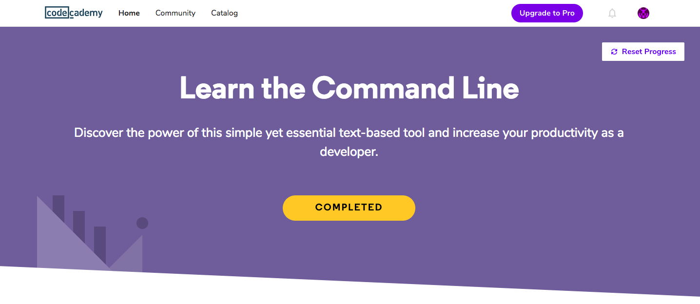

# Stage 0. Self-Study

## Task 0. Git Basics

I have experience with Git but the course "How to use Git and GitHub" from Udacity gave me some new information so it was useful for me. Thanks.
Also I want to share the game that can help to learn git commands:

[git-game](https://github.com/git-game/git-game)

## Task 1. Linux CLI, and HTTP

I got information about HTTP. And I repeated basic CLI commands.

## Task 2. Git Collaboration

In this lesson I discovered difference between `git fetch` and `git pull`.

## Task 3. Intro to HTML and CSS

I've finished these courses long ago.

